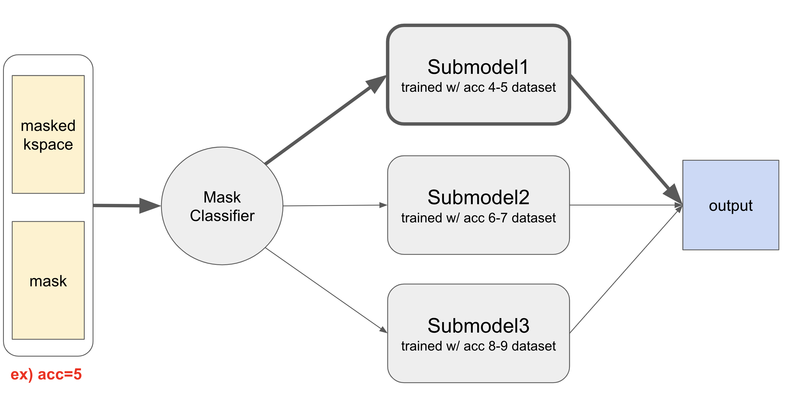

# 2024 SNU FastMRI_challenge
[2024 SNU FastMRI challenge](https://fastmri.snu.ac.kr/) is a challenge based on [Facebook AI's FastMRI challenge](https://web.archive.org/web/20230324102125mp_/https://fastmri.org/leaderboards), but with different conditions. Below are the new conditions added by SNU FastMRI Challenge.
* 8GB VRAM
* Only multi-coil brain datasets
* More types of acceleration
  - Train dataset : 4X, 5X, 8X
  - Valid dataset : 4X, 5X, 8X
  - Leaderboard dataset : 5X, 9X
  - Test dataset : (not revealed)
    - The top teams on the leaderboard were tested on the test dataset to determine the final rankings.
* Lesser datasets (4X : 118 people, 5X : 118 people, 8X : 120 people)
* Can not use pretrained model
* Limited inference time (3,000 seconds)

You can check SNU FastMRI challenge's baseline models and codes [here](https://github.com/LISTatSNU/FastMRI_challenge). [E2E VarNet](https://arxiv.org/abs/2004.06688) and UNet were given as baseline models.

[AIRS Medical](https://airsmed.com/en/), which developed AIRS-Net and is currently leading the public leaderboard of the Facebook AI FastMRI Challenge, sponsored the competition.

## What is fastMRI?
FastMRI is accelerating the speed of MRI scanning by acquiring fewer measurements. This may reduce medical costs per patient and improve patients' experience.

## SuperFastMRI team
We participated in the 2024 SNU FastMRI Challenge as a two-person team named SuperFastMRI.

### Team Members
* Dongwook Kho
  - Undergraduate in the Department of Electrical and Computer Engineering, Seoul National University
  - Email : kho2011@snu.ac.kr, khodong2014@gmail.com
  - github : [KhoDongwook](https://github.com/KhoDongwook)
* Yoongon Kim
  - Undergraduate in the Department of Electrical and Computer Engineering, Seoul National University
  - Email : yoon_g_kim@snu.ac.kr, yooongonkim@gmail.com
  - github: [Yoongon-Kim](https://github.com/Yoongon-Kim)

## Our Model
Our model uses MoE strategy with three [Feature-Image (FI) VarNet](https://www.nature.com/articles/s41598-024-59705-0) sub-models. However, due to the 8GB limit on GPU VRAM, we discarded Block-wise Attention in each FI-VarNet sub-model to save memory for more cascades and deeper UNets within the sub-model.

### MoE strategy
We created submodels specialized for specific acceleration ranges to handle various types of acceleration. When an input is received, the model calculates its acceleration and forwards it to the submodel specialized for that acceleration. The result is then outputted. If the input’s acceleration is not covered by the ranges of the submodels, it is forwarded to the model with the closest acceleration range.

### Feature-Image VarNet
E2E VarNet, the baseline model, is powerful, but some information was lost in the refinement module. This is basically because the data consistency (DC) module performs updates of tensor in the 2 channel k-space domain while, in the refinement module, the updates are performed in the feature-space where the tensor's channel number increases upto 32. In the feature-space, we can gain high-level features, but most of them are lost in the process of converting the tensor back into the k-space in order to perform DC module update.

Feature-Image (FI) VarNet resolves this problem by making DC module perform updates of tensor in the feature-space rather than in k-space. Therefore, the tensor retains a large number of feature channels throughout the network’s cascades. The high-level features which is lost in E2EVarNet's refinement modules are now preserved in FI VarNet.

However, we abandoned Block-attention module in FI VarNet due to the 8GB limit on GPU VRAM. Block-attention module's role is to reducing computational complexity while enhancing the model’s ability to identify spatial locations of aliasing artifacts caused by Cartesian undersampling. After experimenting with various hyperparameters, we reached to a conclusion that getting more cascades and deeper UNets is way more efficient in training than maintaining Block-attention module. We believe that the reason block-wise attention did not improve the model’s performance was because the attention block consumed memory, reducing the size of the base model that needed to be maintained.

## Techniques
list~~
### MRAugment

## Reference
[1] Zbontar, J.*, Knoll, F.*, Sriram, A.*, Murrell, T., Huang, Z., Muckley, M. J., ... & Lui, Y. W. (2018). fastMRI: An Open Dataset and Benchmarks for Accelerated MRI. arXiv preprint arXiv:1811.08839.

[2] Sriram, A.*, Zbontar, J.*, Murrell, T., Defazio, A., Zitnick, C. L., Yakubova, N., ... & Johnson, P. (2020). End-to-End Variational Networks for Accelerated MRI Reconstruction. In MICCAI, pages 64-73.

[3] Ronneberger, O., Fischer, P., & Brox, T. (2015, October). U-net: Convolutional networks for biomedical image segmentation. In International Conference on Medical image computing and computer-assisted intervention (pp. 234-241). Springer, Cham.
